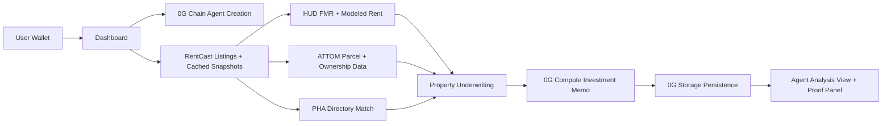

# Sect8

Sect8 is an AI acquisition agent for Section 8 rental investing. It creates a wallet-linked agent on 0G Mainnet, scans live or cached for-sale inventory, enriches each property with housing and ownership data, runs a 0G Compute-backed investment memo, and persists agent state plus analysis artifacts through 0G Storage.

## Project Overview

Sect8 is built for investors who want a faster way to find and underwrite Section 8 opportunities before making an offer.

The core workflow is:

1. Create or restore a wallet-linked Sect8 agent.
2. Pull property inventory and supporting housing data.
3. Build underwriting inputs such as rent support, cash flow, cap rate, and ROI.
4. Run a property memo through 0G Compute.
5. Persist the resulting analysis and agent state through 0G Storage.
6. Present a decision-ready property dossier with verification context for ownership, parcel records, deed history, hazard signals, and housing-authority contacts.

Sect8 is intentionally narrow. It is not a generic chat bot or a general market browser. It is a Section 8 deal-finding and underwriting workflow anchored on 0G Compute, 0G Storage, and 0G Chain.

## Early Community Feedback

Early outreach to real estate investors and operators generated positive feedback around the usability and market relevance of Sect8.

### Investor validation

[](https://x.com/i/status/2054863572816060686)

> "What you built here is excellent. If I were a Section 8 investor, I would absolutely use it."

-- Thom Sieloff, Multifamily Investor

Source: [Thom Sieloff feedback on X](https://x.com/i/status/2054863572816060686)

### Demo demand

[](https://x.com/i/status/2055269303692284306)

> "Let me get a demo"

-- slumlordmillionaire

Source: [slumlordmillionaire feedback on X](https://x.com/i/status/2055269303692284306)

### Facebook outreach testing

We began testing Sect8 directly with Section 8 investor communities through Facebook outreach and targeted ads.

Within early testing, we started receiving inbound investor questions about pricing, onboarding, and deal analysis workflows.

This validated two things:

1. Investors are actively searching for better underwriting workflows.
2. AI-assisted Section 8 analysis reduces friction compared to spreadsheets and manual research.

Example investor inquiry during testing:


### Infrastructure provider engagement

We also received positive engagement from RentCast, one of the infrastructure providers powering our real estate data layer.


The feedback particularly validated:

- the Market discovery workflow
- underwriting UX
- investor-focused positioning
- demand from Section 8-focused markets

## Hackathon Progress

During the hackathon, Sect8 moved from a prototype into a product workflow backed by real external data and real 0G infrastructure.

### What changed

- Replaced fake or misleading property content with real-source data across the workflow.
- Integrated RentCast for live for-sale inventory and cached listing restoration.
- Integrated HUD Fair Market Rent data for voucher-oriented rent benchmarking.
- Integrated ATTOM for parcel, ownership, tax, sale-history, and area-risk context.
- Integrated ZIP and county resolution services so listings can be connected to local housing-authority and voucher context.
- Added underwriting calculations for projected cash flow, cap rate, and ROI so the product evaluates deals instead of only browsing listings.
- Integrated 0G Compute for structured property analysis generation.
- Integrated 0G Storage for agent memory, listing snapshots, ATTOM snapshots, and persisted analysis roots.
- Deployed the Sect8AgentManager contract on 0G Mainnet and wired the create-agent flow to the deployed contract.
- Made onchain agent initialization part of the real user journey instead of leaving chain usage as a side deployment.
- Required verified onchain activation before restoring an agent, including persisted token ID and activation transaction hash.
- Improved memory recovery so verified analyses shown in the dashboard are backed by persisted storage roots.
- Reworked property analysis into a staged agent-analysis session with clearer loading states and runtime proof output.
- Tightened slow external-fetch behavior so the app fails fast instead of hanging on delayed providers.
- Added stricter listing exclusion so land and vacant-lot inventory are filtered out of the dashboard and market instead of being scored as Section 8 opportunities.

- Prioritized target markets: Detroit (MI), Cleveland (OH), and Memphis (TN) — focus areas chosen for historically higher Section 8 profitability and product validation.

### Major website rebrand

The product was also rebranded during the hackathon.

- Replaced the earlier prototype presentation with a more institutional product identity across the landing page, dashboard, market feed, and analysis surfaces.
- Updated the website copy to position Sect8 as a Section 8 acquisition and underwriting platform instead of a generic AI demo.
- Reworked the property-analysis experience so the UI now emphasizes decision-ready underwriting, proof of infrastructure usage, and verifiable data context.
- Removed misleading or empty interface sections and aligned the product presentation with the real workflow that now exists behind it.

### Why this matters

The result is not just a nicer interface. Sect8 now uses real listing data, real rent benchmarks, real property records, real 0G Compute, real 0G Storage, and real 0G Mainnet agent creation inside the actual investor workflow.

## System Architecture

### Technical Description

- Frontend: Next.js App Router UI for the landing page, dashboard, market page, and property analysis pages.
- Agent identity: a 0G Mainnet ERC-721 contract creates a wallet-linked Sect8 agent.
- Listing layer: RentCast sale inventory plus locally cached listing snapshots.
- Rent support layer: HUD Fair Market Rent data, with a modeled fallback when HUD support cannot be verified.
- Property intelligence layer: ATTOM parcel, owner, tax, sale-history, and community risk context.
- Voucher operations layer: local housing-authority directory matching by ZIP, city, county, and state.
- Analysis layer: 0G Compute generates the structured investment memo.
- Persistence layer: 0G Storage stores agent state, listings snapshots, ATTOM snapshots, and property-analysis payloads.

### Architecture Diagram



## External Data and How It Is Used

Sect8 uses several external data sources and support datasets. Each has a specific role in the underwriting workflow.

### 1. RentCast sale listings

- Source: RentCast sale listings API
- Main file: `src/lib/realDataService.ts`
- Supporting cache file: `data/rentcast-cache.json`
- Supporting cache helpers: `src/lib/rentcastCache.ts`

How it is used:

- Pulls active for-sale inventory by ZIP code.
- Supplies the property address, price, bedrooms, bathrooms, property type, square footage, and listing URL used in the dashboard and market views.
- Provides the base listing record that later gets enriched with ATTOM, HUD, and PHA context.
- Scan results can be cached locally and linked to 0G Storage roots so the app can restore prior listing snapshots.

### 2. HUD Fair Market Rent data

- Source: HUD FMR API and bundled HUD cache
- Main file: `src/lib/realDataService.ts`
- Bundled cache file: `data/hud-fmr-cache.json`

How it is used:

- Resolves the Fair Market Rent for the property ZIP and bedroom count when HUD support is available.
- Drives voucher-oriented rent benchmarking for Section 8 underwriting.
- Feeds the underwriting model that calculates annual rent, cash flow, cap rate, and ROI.
- If HUD data cannot be verified, the app falls back to a modeled rent estimate and explicitly labels it as modeled instead of pretending it is HUD-backed.

### 3. ATTOM property and ownership data

- Source: ATTOM property APIs
- Main file: `src/lib/propertyDetails.ts`

How it is used:

- Pulls parcel identifiers, APN, property use, year built, lot details, latitude, and longitude.
- Pulls owner name, mailing address, absentee-owner status, and corporate-owner indicators.
- Pulls assessed value, market value, tax amount, assessor year, and tax year.
- Pulls deed and sale-history records to expose transfer history and ownership continuity.
- Pulls community risk context such as flood, fire, environmental, and natural-disaster indicators.
- Provides the verification context shown in the property dossier so the memo is not based on listing data alone.

### 4. Housing authority directory data

- Source: locally bundled housing-authority directory
- Main file: `src/lib/phaDirectory.ts`
- Data file: `data/pha-directory.json`

How it is used:

- Matches a property to a likely housing authority using ZIP, city, county, and state.
- Exposes phone, email, office address, program type, and source URL when available.
- Gives the investor an actual operational next step for voucher verification instead of stopping at a financial score.

### 5. ZIP and county lookup services

- Sources: Zippopotam.us and FCC Census Block API
- Main file: `src/lib/realDataService.ts`

How it is used:

- Resolves ZIP metadata such as state, latitude, and longitude.
- Resolves county FIPS codes for HUD FMR lookup and housing-authority matching.
- Supports the rent and PHA matching pipeline rather than serving as a user-facing feature.

## 0G Modules Used

### 1. 0G Chain

- Contract: `contracts/Sect8AgentManager.sol`
- Deploy script: `scripts/deploy.ts`
- Client activation flow: `src/lib/agentActivation.ts`

What it does in Sect8:

- Mints a wallet-linked Sect8 agent NFT.
- Stores the initial `memoryRoot` passed into `initializeAgent`.
- Allows later agent-state updates and decision logging.
- Anchors the agent identity on 0G Mainnet instead of keeping it only in client state.

### 2. 0G Compute

- Compute client: `src/og-integration/compute.ts`
- Main property analysis flow: `src/lib/propertyAnalysis.ts`
- Supporting agent compute route: `src/app/api/agentCompute/route.ts`
- Supporting ranking/decision helpers: `src/lib/ogAgent.ts`, `src/lib/agentDecision.ts`

What it does in Sect8:

- Generates the structured property investment memo.
- Produces the summary, verdict, strengths, risks, next steps, and confidence.
- Returns the provider metadata used in the new Agent analysis proof panel.

### 3. 0G Storage

- Storage client: `src/og-integration/storage.ts`
- Upload wrapper: `src/app/actions/og.ts`
- Agent create/persist routes: `src/app/api/agents/create/route.ts`, `src/app/api/agents/uploadMemory/route.ts`
- Analysis persistence: `src/lib/propertyAnalysis.ts`
- Session and JSON snapshot helpers: `src/lib/0gPersistence.ts`, `src/lib/propertyDetailsSession.ts`

What it does in Sect8:

- Stores the initial agent memory root before on-chain activation.
- Stores updated memory and agent record snapshots.
- Stores listings snapshots and normalized listing payloads.
- Stores ATTOM-backed property snapshots.
- Stores property-analysis payloads and their retrievable storage roots.

## How the Product Flow Works

1. A user connects a wallet and creates or restores a Sect8 agent.
2. The app prepares an initial memory object and uploads it to 0G Storage.
3. The wallet signs a 0G Mainnet transaction that calls `initializeAgent` on the Sect8 agent manager contract.
4. The dashboard runs a ZIP-based scan and loads listing inventory.
5. When a property is opened, Sect8 assembles listing, rent, ATTOM, and housing-authority context.
6. Sect8 computes underwriting inputs and sends the full property bundle to 0G Compute.
7. The returned memo is normalized, stored to 0G Storage, and attached back to the property flow through a storage root.
8. The Agent analysis UI shows both the final memo and the runtime proof artifacts for the compute and storage steps.

## Listing images & external listing links

The property details page surfaces listing images (when available) and convenient external links so users can review the live listing on third-party sites:

- External listing links: the details page includes quick-search buttons (Zillow, Realtor.com, Redfin) that open a pre-filled search for the property address in a new tab. The UI explicitly invites users to click the Zillow button to view the live listing page, image gallery, listing agent contact details, and other third-party context.

## Agent creation & funding flow (what changed)

Users now create a wallet-linked Sect8 agent as a clear, guided flow in the app. The creation path has been hardened so the on-chain activation is reliable and repeatable:

- The user connects a wallet and requests agent creation from the UI (Dashboard / Create Agent flows).
- The frontend now verifies the user's native balance and, when below a minimum threshold, calls a server-side funding endpoint to top up the wallet with a small native amount so the user can sign the on-chain initialization transaction.
- The server funding route sends a small native transfer and returns the funding transaction hash; the frontend waits for the funding transaction confirmation and polls the user's wallet balance before proceeding.
- Once the wallet has enough native gas, the app prepares the initial agent memory object and uploads it to 0G Storage, then asks the user to sign the on-chain `initializeAgent` call to mint the wallet-linked Sect8 NFT and anchor the memory root on 0G Chain.
- After on-chain confirmation, the app finalizes the agent record (persisting record roots and linking the on-chain tokenId and activation transaction hash) and resumes normal scanning and analysis flows.

This flow guarantees that users always have sufficient gas to complete on-chain activation and that activations are backed by persisted 0G Storage roots and an on-chain proof.

## 0G Integration Proof

### 0G Mainnet Contract

- Contract address: `0x7D3BF702030Ea8a9988f3A2ddc46ba7DaE315F7a`
- Explorer: `https://explorer.0g.ai/address/0x7D3BF702030Ea8a9988f3A2ddc46ba7DaE315F7a`

### What is actually using 0G

- 0G Chain is used to mint the wallet-linked Sect8 agent NFT and anchor the initial memory root.
- 0G Compute is used to generate the property investment memo shown on the property analysis page.
- 0G Storage is used to persist agent memory, listings snapshots, ATTOM-backed property snapshots, and property-analysis records.

### New proof surface: Agent analysis proof panel

The strongest runtime proof surface is now the `Agent analysis` view. During a live property analysis run, the panel shows structured proof artifacts pulled from the actual 0G-backed execution path:

- compute status
- provider address
- compute endpoint
- model name
- returned response ID
- HTTP status
- storage root for the persisted analysis
- live session lines showing the compute and storage path that completed

This is implemented through:

- compute metadata capture: `src/og-integration/compute.ts`
- analysis record persistence: `src/lib/propertyAnalysis.ts`
- session proof propagation: `src/lib/propertyDetailsSession.ts`
- live proof UI: `src/components/PropertyDetailsLoadingState.tsx`
- completed analysis proof UI: `src/components/PropertyDetailsView.tsx`

### Why the proof is trustworthy

The app does not claim 0G success unconditionally. It only shows the 0G proof values when those runtime steps actually succeeded.

- If compute succeeds, the completed page shows `Analysis generated with: 0G Compute`.
- If compute fails, the page falls back to `fallback analysis`.
- If storage succeeds, the completed page shows `Stored at: 0x...`.
- If storage fails, the page shows `Storage upload unavailable`.
- The live Agent analysis panel now exposes provider, response, and storage artifacts from the actual run instead of only showing generic loading text.

## Judge / Reviewer Notes

### Fastest verification path

This is the clearest end-to-end path for judges to verify the project is really using 0G Chain, 0G Compute, and 0G Storage for the workflow we claim.

1. Verify the contract on 0G Explorer:

   - `0x7D3BF702030Ea8a9988f3A2ddc46ba7DaE315F7a`
   - `https://explorer.0g.ai/address/0x7D3BF702030Ea8a9988f3A2ddc46ba7DaE315F7a`

2. Start the app and open `/dashboard`.
3. Connect a wallet and create or restore an agent.
4. Run a ZIP-based scan.
5. Open any `Agent analysis` page for a property.
6. In the live proof panel, verify that the run exposes:

   - the 0G compute provider address
   - the compute endpoint and model
   - a returned response ID
   - an HTTP success status
   - a 0G Storage root for the persisted analysis

7. On the completed page, verify these lines:

   - `Analysis generated with: 0G Compute`
   - `Stored at: 0x...`

8. Reopen the same property or refresh the flow and verify the app can recover the saved analysis instead of inventing a new one.

### What exactly this proves

#### 1. 0G Chain proof

The explorer verifies that the Sect8 agent manager contract is deployed on 0G Mainnet.

Relevant code:

- `contracts/Sect8AgentManager.sol`
- `src/lib/agentActivation.ts`

#### 2. 0G Compute proof

The Agent analysis panel now exposes provider and response metadata tied to the live run. The completed page labels the memo as `0G Compute` only when the property analysis flow successfully returned from the 0G compute path.

Relevant code:

- `src/og-integration/compute.ts`
- `src/lib/propertyAnalysis.ts`
- `src/lib/propertyDetailsSession.ts`

Discriminating check:

- If the 0G compute call fails, the UI says `fallback analysis`, not `0G Compute`.

#### 3. 0G Storage proof for property analysis

After compute completes, Sect8 uploads a structured `property-analysis` payload to 0G Storage and keeps the returned root.

Relevant code:

- `src/lib/propertyAnalysis.ts` -> `uploadAnalysisRecord()`
- `src/og-integration/storage.ts`

Discriminating checks:

- The live proof panel exposes the returned storage root.
- The completed page shows `Stored at: 0x...` only when the upload succeeded.
- On repeat open, the app can read the saved payload back from 0G Storage using that root.

#### 4. 0G Storage proof for agent state

Sect8 also uses 0G Storage before and after activation to persist agent memory and agent-record state.

Relevant code:

- `src/app/actions/og.ts`
- `src/app/api/agents/create/route.ts`
- `src/app/api/agents/uploadMemory/route.ts`

### Optional API-level verification

Judges who want a direct storage check without relying only on the UI can call the memory-upload endpoint locally.

```bash
curl -X POST http://localhost:3000/api/agents/uploadMemory \
	-H "Content-Type: application/json" \
	-d '{"memory":{"agentId":"judge-check","history":["0G storage verification"]}}'
```

Expected result:

- `success: true`
- `hash: 0x...`

That hash is the 0G Storage root returned by the SDK upload path.

### What judges should reject

If the app shows either of these values during the property flow, that means the 0G path did not complete successfully for that specific run:

- `fallback analysis`
- `Storage upload unavailable`

### Reviewer guidance

- The most important feature to evaluate is the property-analysis flow and its proof panel.
- 0G Chain is used for agent creation and identity anchoring.
- 0G Compute is used for memo generation.
- 0G Storage is used for state and analysis persistence.
- RentCast, HUD, ATTOM, and the housing-authority directory are all used as real underwriting inputs rather than decorative metadata.

## Local Deployment / Reproduction Steps

### Prerequisites

- Node.js 20+
- npm
- A funded 0G-compatible wallet or private key for storage uploads and chain deployment

### Environment Variables

Create a `.env` file in the project root and set the values required by your environment.

Minimum 0G-related variables:

```bash
OG_RPC_URL=https://evmrpc.0g.ai
OG_STORAGE_URL=https://indexer-storage-turbo.0g.ai
OG_COMPUTE_PROVIDER=your_0g_compute_provider_address
OG_COMPUTE_API_KEY=your_0g_compute_api_key
OG_COMPUTE_MODEL=deepseek/deepseek-chat-v3-0324
AGENT_DEPLOYER_PRIVATE_KEY=your_private_key
NEXT_PUBLIC_AGENT_MANAGER_ADDRESS=your_deployed_contract_address
```

Common external-data variables:

```bash
RENTCAST_API_KEY=your_rentcast_api_key
ATTOM_API_KEY=your_attom_api_key
HUD_USER_API_TOKEN=your_hud_token_optional
HUD_ENABLE_LIVE_FETCH=0
```

x402 / Agentic Market variables:

```bash
# Testnet default
X402_NETWORK=eip155:84532
X402_FACILITATOR_URL=https://x402.org/facilitator

# Mainnet / Agentic Market production
# X402_NETWORK=eip155:8453
# CDP_API_KEY_ID=your_cdp_api_key_id
# CDP_API_KEY_SECRET=your_cdp_api_key_secret

X402_PAY_TO=0xYourReceivingWallet
X402_SECTION8_ANALYSIS_PRICE=$0.05
```

Notes:

- If `HUD_ENABLE_LIVE_FETCH` is disabled, Sect8 reads the committed HUD cache from `data/hud-fmr-cache.json`.
- If ATTOM is unavailable, the property dossier still renders, but ATTOM-backed verification sections will be limited.
- If RentCast is unavailable, live sale listings are unavailable and the app relies on cached listing data where present.
- The paid Agentic Market endpoint is `POST /api/x402/section8-analysis`. It accepts either `{ "listingId": "...", "listingsRoot": "..." }` for an existing Sect8 listing, or direct property input such as `{ "address": "...", "zipCode": "48204", "purchasePrice": 85000, "bedrooms": 3 }`.
- For Agentic Market discovery, deploy the app publicly over HTTPS and validate the paid endpoint at `https://agentic.market/validate`.

### Install

```bash
npm install
```

### Refresh bundled HUD FMR data

Run this from a US-accessible environment when you want to refresh the committed HUD rent cache:

```bash
npm run import:hud
```

This writes `data/hud-fmr-cache.json`, which lets deployed users keep a working HUD-based rent path even when live HUD access is restricted.

### Run in Development

```bash
npm run dev
```

### Build and Run Production

```bash
npm run build
npm run start
```

### Open the App

- Landing page: `http://localhost:3000`
- Dashboard: `http://localhost:3000/dashboard`
- Market page: `http://localhost:3000/market`

## Contract Deployment

To deploy the Sect8 agent manager contract to 0G:

```bash
npx hardhat run scripts/deploy.ts --network og
```

After deployment, record the deployed contract address in `NEXT_PUBLIC_AGENT_MANAGER_ADDRESS`.

## Repository Notes

- Main dashboard route: `src/app/dashboard/page.tsx`
- Property details and ATTOM integration: `src/lib/propertyDetails.ts`
- Property analysis pipeline: `src/lib/propertyAnalysis.ts`
- Live analysis session pipeline: `src/lib/propertyDetailsSession.ts`
- 0G compute integration: `src/og-integration/compute.ts`
- 0G storage integration: `src/og-integration/storage.ts`
- 0G chain contract: `contracts/Sect8AgentManager.sol`

## Submission Summary

Sect8 is a Section 8 acquisition agent built on top of 0G Chain, 0G Compute, and 0G Storage. It scans property listings, enriches them with HUD rent support, ATTOM verification data, and housing-authority contacts, then produces a decision-ready investment memo and exposes the live 0G proof artifacts directly in the Agent analysis view.
