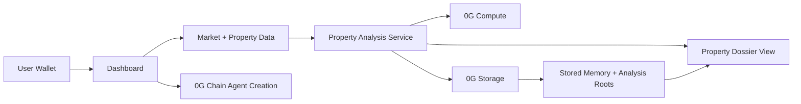

# Sect8

Sect8 is a Section 8 acquisition platform that helps investors find for-sale homes, run 0G-powered property analysis, and preserve the resulting research with 0G-backed memory. The product focuses on one core workflow: create a user agent on 0G chain, analyze properties with 0G compute, and persist analysis and memory state with 0G storage.

## Project Overview

Sect8 is built for investors who buy rental property and want faster first-pass underwriting for Section 8 opportunities.

The product workflow is:

1. Create a user agent tied to a wallet.
2. Pull for-sale inventory and supporting housing data.
3. Run property analysis using 0G compute.
4. Store memory and analysis artifacts using 0G storage.
5. Present a decision-ready property dossier with cash flow, cap rate, ROI, ownership context, hazard context, and housing-authority contacts.

This repo intentionally positions Sect8 as a user-directed analysis product. The strongest part of the project is the use of 0G compute for property analysis, with 0G storage for persistent memory and 0G chain for agent creation.

## System Architecture

### Technical Description

- Frontend: Next.js App Router UI for landing page, dashboard, market page, and property analysis views.
- Data layer: listing data, HUD fair market rent, ATTOM property context, and PHA contact data.
- Analysis layer: 0G compute generates property-level analysis and decision text.
- Storage layer: 0G storage persists memory and analysis payloads as retrievable roots.
- Chain layer: a Sect8 agent contract on 0G Mainnet creates a chain-backed user agent identity.

### Architecture Diagram



## 0G Modules Used

### 1. 0G Compute

Used for property-level analysis generation.

- Integration file: `src/og-integration/compute.ts`
- Main analysis usage: `src/lib/propertyAnalysis.ts`
- Supporting analysis usage: `src/app/api/agentCompute/route.ts`, `src/lib/agentDecision.ts`, `src/lib/ogAgent.ts`

What it does in Sect8:

- Generates structured investment analysis for a property.
- Produces reasoning, strengths, risks, next steps, and confidence.
- Powers the property dossier experience.

### 2. 0G Storage

Used for memory and analysis persistence.

- Integration file: `src/og-integration/storage.ts`
- Upload helper: `src/app/actions/og.ts`
- Used by agent creation, memory sync, scan persistence, and property analysis caching.

What it does in Sect8:

- Stores initial agent memory.
- Stores updated memory roots tied to agent activity.
- Stores property-analysis payloads and analysis roots.
- Lets the UI show that an analysis was persisted through the 0G stack.

### 3. 0G Chain

Used for user agent creation.

- Contract: `contracts/Sect8AgentManager.sol`
- Deploy script: `scripts/deploy.ts`

What it does in Sect8:

- Creates a chain-backed Sect8 agent identity for a user.
- Anchors the agent concept to a wallet and contract path on 0G Mainnet.

Current scope note:

- In this project, 0G chain is used for agent creation. The main product emphasis is on 0G compute for analysis rather than on-chain execution of every workflow step.

## How the 0G Modules Support the Product

- 0G compute is the product differentiator. It turns raw property inputs into a readable, structured investment analysis instead of just showing listings.
- 0G storage preserves memory and analysis artifacts so the workflow can recover state and show proof of persistence.
- 0G chain gives each user a chain-backed agent creation path, which makes the agent identity more durable than a client-only profile.

## Key Product Capabilities

- Pulls for-sale inventory instead of generic market browsing.
- Calculates projected cash flow, cap rate, and ROI.
- Adds ATTOM ownership, parcel, tax, deed, and hazard context.
- Adds housing-authority contacts where available.
- Produces a property dossier backed by 0G compute analysis.
- Persists memory and analysis roots through 0G storage.

## Local Deployment / Reproduction Steps

### Prerequisites

- Node.js 20+
- npm
- A funded 0G-compatible wallet/private key for storage uploads and chain deployment

### Environment Variables

Create a `.env` file in the project root and set the values required by your environment.

Minimum 0G-related variables:

```bash
OG_RPC_URL=https://evmrpc.0g.ai
OG_STORAGE_URL=https://indexer-storage-turbo.0g.ai
OG_COMPUTE_PROVIDER=your_0g_compute_provider_address
OG_COMPUTE_API_KEY=your_0g_compute_api_key
OG_COMPUTE_MODEL=deepseek/deepseek-chat-v3-0324
AGENT_DEPLOYER_PRIVATE_KEY=your_private_key
```

Additional product data providers used by this repo may require their own keys depending on the flows you exercise.

### Install

```bash
npm install
```

### Run in Development

```bash
npm run dev
```

### Build and Run Production

```bash
npm run build
npm run start
```

### Open the App

- Landing page: `http://localhost:3000`
- Dashboard: `http://localhost:3000/dashboard`
- Market page: `http://localhost:3000/market`

## Contract Deployment

To deploy the Sect8 agent manager contract to 0G:

```bash
npx hardhat run scripts/deploy.ts --network og
```

After deployment, record the deployed contract address in your environment or app configuration as needed.

## Judge / Reviewer Notes

### What to test first

1. Open the dashboard.
2. Create or restore an agent.
3. Run a ZIP-based scan.
4. Open an `Agent Analysis` page for a property.
5. Confirm that the analysis view shows the provider and storage root when available.

### Faucet / wallet notes

- Judges who want to exercise storage uploads or contract deployment need a funded account on the relevant 0G network.
- If a wallet has no balance, chain deployment and some storage-backed operations may fail.

### Reviewer guidance

- The most important feature to evaluate is the property-analysis flow powered by 0G compute.
- 0G storage is used to persist memory and analysis roots.
- 0G chain is used for user agent creation rather than broad workflow execution.

## Repository Notes

- Main dashboard route: `src/app/dashboard/page.tsx`
- Property analysis pipeline: `src/lib/propertyAnalysis.ts`
- 0G compute integration: `src/og-integration/compute.ts`
- 0G storage integration: `src/og-integration/storage.ts`
- 0G chain contract: `contracts/Sect8AgentManager.sol`

## Submission Summary

Sect8 is a 0G-powered Section 8 acquisition platform whose core advantage is property analysis on 0G compute. The project uses:

- 0G compute for analysis generation
- 0G storage for memory and analysis persistence
- 0G chain for user agent creation

That is the intended product scope and the clearest way to evaluate the project.
