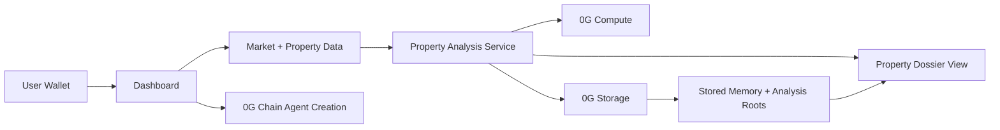

# Sect8

Sect8 is the AI agent that finds Section 8 deals and analyzes them before you buy. The product focuses on one core workflow: create a user agent on 0G chain, analyze properties with 0G compute, and persist analysis and memory state with 0G storage.

## Project Overview

Sect8 is built for investors who buy rental property and want an AI agent to help them find, screen, and analyze Section 8 opportunities faster.

The product workflow is:

1. Create a user agent tied to a wallet.
2. Pull for-sale inventory and supporting housing data.
3. Run property analysis using 0G compute.
4. Store memory and analysis artifacts using 0G storage.
5. Present a decision-ready property dossier with cash flow, cap rate, ROI, ownership context, hazard context, and housing-authority contacts.

This repo positions Sect8 as an AI agent for Section 8 acquisitions. The strongest part of the project is the use of 0G compute for property analysis, with 0G storage for persistent memory and 0G chain for agent creation.

## System Architecture

### Technical Description

- Frontend: Next.js App Router UI for landing page, dashboard, market page, and property analysis views.
- Data layer: listing data, HUD fair market rent, ATTOM property context, and PHA contact data.
- Analysis layer: 0G compute generates property-level analysis and decision text.
- Storage layer: 0G storage persists memory and analysis payloads as retrievable roots.
- Chain layer: a Sect8 agent contract on 0G Mainnet creates a chain-backed user agent identity.

### Architecture Diagram



## 0G Integration Proof

### 0G Mainnet Contract

- Contract address: `0x7D3BF702030Ea8a9988f3A2ddc46ba7DaE315F7a`
- Explorer: `https://explorer.0g.ai/address/0x7D3BF702030Ea8a9988f3A2ddc46ba7DaE315F7a`

### What is actually using 0G

- 0G Compute is used to generate the property investment memo shown on the property analysis page.
- 0G Storage is used to persist:
	- the initial agent memory root
	- updated agent memory state
	- the property-analysis payload and its storage root
- 0G Chain is used to register the user-facing agent contract path.

### Why the proof is trustworthy

The app does not always claim 0G was used. It only shows the 0G labels when the runtime actually succeeded:

- If compute succeeds, the property page shows `Analysis generated with: 0G Compute`.
- If compute fails, the same UI falls back to `fallback analysis`.
- If storage succeeds, the property page shows `Stored at: 0x...`.
- If storage fails, the same UI shows `Storage upload unavailable`.

This behavior is implemented, not hardcoded marketing copy:

- Compute call: `src/lib/propertyAnalysis.ts` -> `generateAnalysis()` -> `zgCompute.runAnalysis(...)`
- Compute client: `src/og-integration/compute.ts`
- Analysis storage upload: `src/lib/propertyAnalysis.ts` -> `uploadAnalysisRecord()` -> `uploadAgentMemory(...)`
- Storage client: `src/og-integration/storage.ts`
- Property page proof labels: `src/components/PropertyDetailsView.tsx`
- Agent-memory uploads: `src/app/actions/og.ts`, `src/app/api/agents/create/route.ts`, `src/app/api/agents/uploadMemory/route.ts`

## 0G Modules Used

### 1. 0G Compute

Used for property-level analysis generation.

- Integration file: `src/og-integration/compute.ts`
- Main analysis usage: `src/lib/propertyAnalysis.ts`
- Supporting analysis usage: `src/app/api/agentCompute/route.ts`, `src/lib/agentDecision.ts`, `src/lib/ogAgent.ts`

What it does in Sect8:

- Generates structured investment analysis for a property.
- Produces reasoning, strengths, risks, next steps, and confidence.
- Powers the property dossier experience.

### 2. 0G Storage

Used for memory and analysis persistence.

- Integration file: `src/og-integration/storage.ts`
- Upload helper: `src/app/actions/og.ts`
- Used by agent creation, memory sync, scan persistence, and property analysis caching.

What it does in Sect8:

- Stores initial agent memory.
- Stores updated memory roots tied to agent activity.
- Stores property-analysis payloads and analysis roots.
- Lets the UI show that an analysis was persisted through the 0G stack.

### 3. 0G Chain

Used for user agent creation.

- Contract: `contracts/Sect8AgentManager.sol`
- Deploy script: `scripts/deploy.ts`

What it does in Sect8:

- Creates a chain-backed Sect8 agent identity for a user.
- Anchors the agent concept to a wallet and contract path on 0G Mainnet.

Current scope note:

- In this project, 0G chain is used for agent creation. The main product emphasis is on 0G compute for analysis rather than on-chain execution of every workflow step.

## How the 0G Modules Support the Product

- Sect8 is the AI agent layer: it finds deals, ranks them, and opens a decision-ready property dossier before a user buys.
- 0G compute is the product differentiator. It turns raw property inputs into a readable, structured investment analysis instead of just showing listings.
- 0G storage preserves memory and analysis artifacts so the workflow can recover state and show proof of persistence.
- 0G chain gives each user a chain-backed agent creation path, which makes the agent identity more durable than a client-only profile.

## Key Product Capabilities

- Pulls for-sale inventory instead of generic market browsing.
- Calculates projected cash flow, cap rate, and ROI.
- Adds ATTOM ownership, parcel, tax, deed, and hazard context.
- Adds housing-authority contacts where available.
- Produces a property dossier backed by 0G compute analysis.
- Persists memory and analysis roots through 0G storage.

## Local Deployment / Reproduction Steps

### Prerequisites

- Node.js 20+
- npm
- A funded 0G-compatible wallet/private key for storage uploads and chain deployment

### Environment Variables

Create a `.env` file in the project root and set the values required by your environment.

Minimum 0G-related variables:

```bash
OG_RPC_URL=https://evmrpc.0g.ai
OG_STORAGE_URL=https://indexer-storage-turbo.0g.ai
OG_COMPUTE_PROVIDER=your_0g_compute_provider_address
OG_COMPUTE_API_KEY=your_0g_compute_api_key
OG_COMPUTE_MODEL=deepseek/deepseek-chat-v3-0324
AGENT_DEPLOYER_PRIVATE_KEY=your_private_key
```

Additional product data providers used by this repo may require their own keys depending on the flows you exercise.

### Install

```bash
npm install
```

### Refresh bundled HUD FMR data

Run this from a US-accessible environment before deploying when you want to refresh the committed HUD rent cache:

```bash
npm run import:hud
```

This writes `data/hud-fmr-cache.json`, which the app uses at runtime so deployed users are not blocked by HUD regional access restrictions.

### Run in Development

```bash
npm run dev
```

### Build and Run Production

```bash
npm run build
npm run start
```

### Open the App

- Landing page: `http://localhost:3000`
- Dashboard: `http://localhost:3000/dashboard`
- Market page: `http://localhost:3000/market`

## Contract Deployment

To deploy the Sect8 agent manager contract to 0G:

```bash
npx hardhat run scripts/deploy.ts --network og
```

After deployment, record the deployed contract address in your environment or app configuration as needed.

## Judge / Reviewer Notes

### Fastest working verification path

This is the clearest end-to-end path for judges to verify the project is really using 0G Compute and 0G Storage for the workflow we claim.

1. Start the app and open `/dashboard`.
2. Connect a wallet and create or restore an agent.
3. Run a ZIP-based scan.
4. Open any `Agent Analysis` page for a property.
5. On the property page, verify these two lines:

	 - `Analysis generated with: 0G Compute`
	 - `Stored at: 0x...`

6. Refresh the same property flow or reopen the same property from the dashboard.
7. Verify the app reuses the saved memo instead of inventing a new one.

The session pipeline explicitly records this behavior:

- When a new compute-backed memo is created, the session logs `Generated a new 0G investment memo.`
- When the saved analysis root is reused, the session logs `Recovered the saved investment memo for this property.`

That behavior is implemented in `src/lib/propertyDetailsSession.ts` and `src/lib/propertyAnalysis.ts`.

### What exactly this proves

#### 1. 0G Compute proof

The property memo is not labeled as 0G by default. It is labeled `0G Compute` only when `generateAnalysis()` successfully returns `provider: '0g-compute'` after calling the 0G compute service.

Relevant code:

- `src/lib/propertyAnalysis.ts`
- `src/og-integration/compute.ts`

Discriminating check:

- If the 0G compute call fails, the UI will say `fallback analysis`, not `0G Compute`.

#### 2. 0G Storage proof for property analysis

After compute completes, the app uploads a structured `property-analysis` payload to 0G Storage and keeps the returned root hash.

Relevant code:

- `src/lib/propertyAnalysis.ts` -> `uploadAnalysisRecord()`
- `src/og-integration/storage.ts`

Discriminating checks:

- The property page shows `Stored at: 0x...` only when the upload succeeded.
- On repeat open, the app reads the saved payload back from 0G Storage using that root and rehydrates the memo.

#### 3. 0G Storage proof for agent memory

Agent memory is also persisted to 0G Storage, not only property analyses.

Working proof points:

- Agent creation uploads initial memory and returns `memoryRoot`.
- The Memory panel shows the current memory root for the active wallet.
- The upload routes return a storage hash only when 0G Storage succeeds.

Relevant code:

- `src/app/actions/og.ts`
- `src/app/api/agents/create/route.ts`
- `src/app/api/agents/uploadMemory/route.ts`
- `src/components/MemoryPanel.tsx`

### Optional API-level verification

Judges who want a direct storage check without relying only on the UI can call the memory-upload endpoint locally.

Example request:

```bash
curl -X POST http://localhost:3000/api/agents/uploadMemory \
	-H "Content-Type: application/json" \
	-d '{"memory":{"agentId":"judge-check","history":["0G storage verification"]}}'
```

Expected result:

- `success: true`
- `hash: 0x...`

That hash is the 0G Storage root returned by the SDK upload path.

### What judges should reject

If the app shows either of these values during the property flow, that means the 0G path did not complete successfully for that specific run:

- `fallback analysis`
- `Storage upload unavailable`

### Faucet / wallet notes

- Judges who want to exercise storage uploads or contract deployment need a funded account on the relevant 0G network.
- If a wallet has no balance, chain deployment and some storage-backed operations may fail.

### Reviewer guidance

- The most important feature to evaluate is the property-analysis flow powered by 0G compute.
- 0G storage is used to persist memory and analysis roots.
- 0G chain is used for user agent creation rather than broad workflow execution.

## Repository Notes

- Main dashboard route: `src/app/dashboard/page.tsx`
- Property analysis pipeline: `src/lib/propertyAnalysis.ts`
- 0G compute integration: `src/og-integration/compute.ts`
- 0G storage integration: `src/og-integration/storage.ts`
- 0G chain contract: `contracts/Sect8AgentManager.sol`

## Submission Summary

Sect8 is the AI agent that finds Section 8 deals and analyzes them before you buy. Its core advantage is property analysis on 0G compute. The project uses:

- 0G compute for analysis generation
- 0G storage for memory and analysis persistence
- 0G chain for user agent creation

That is the intended product scope and the clearest way to evaluate the project.
